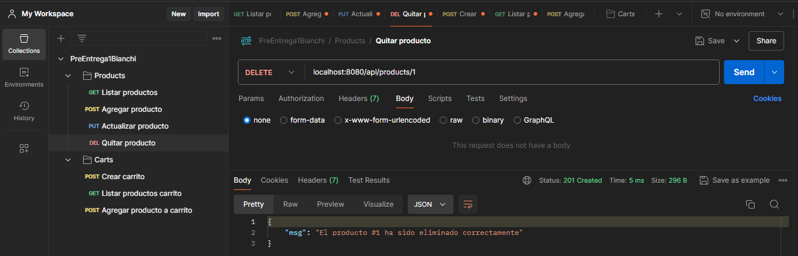

# Aplicación Backend E-Commerce **Parte I**

## Proyecto: E-Commerce "MundoCamisetas"

En esta etapa del proyecto estaremos desarrollando la parte BACKEND del e-commerce de la web MUNDOCAMISETAS.
En la parte I iniciamos con los metodos y pruebas con POSTMAN, agregado de motor de plantillas y base de datos con MONGO.

## Tabla de Contenidos
1. [Instalación](#instalación)
2. [Configuración](#configuración)
3. [Uso](#uso)
4. [Autores y Reconocimientos](#autores-y-reconocimientos)
5. [Contactos y Soporte](#contactos-y-soporte)

## Instalación
### Requisitos previos
- Node.js v16 o superior.
- Express.

## Configuración
### Variables de entorno
`PORT`: El puerto en el que la aplicación se ejecutará (por defecto: 8080).\

## Uso
### Endpoints RAIZ de la API
**GET** `/api/products`: Obtiene la lista de pproductos.\
**GET** `/api/carts`: Obtiene la lista de carritos.

A continuacion, imágenes con las pruebas realizadas segun las rúbricas de la Pre Entrega 1:

#GetProducts

#GetProductsLimit

#GetProductByID

#PostProduct

#PutProduct

#DeleteProduct

------------

#PostCart

#GetCart

#PostProductToCartID

## Autores y reconocimientos
* Fabio Bianchi - Desarrollador principal - 

## Contacto y soporte
Para preguntas o soporte, contacta a fabiobianchicaseros@gmail.com.

